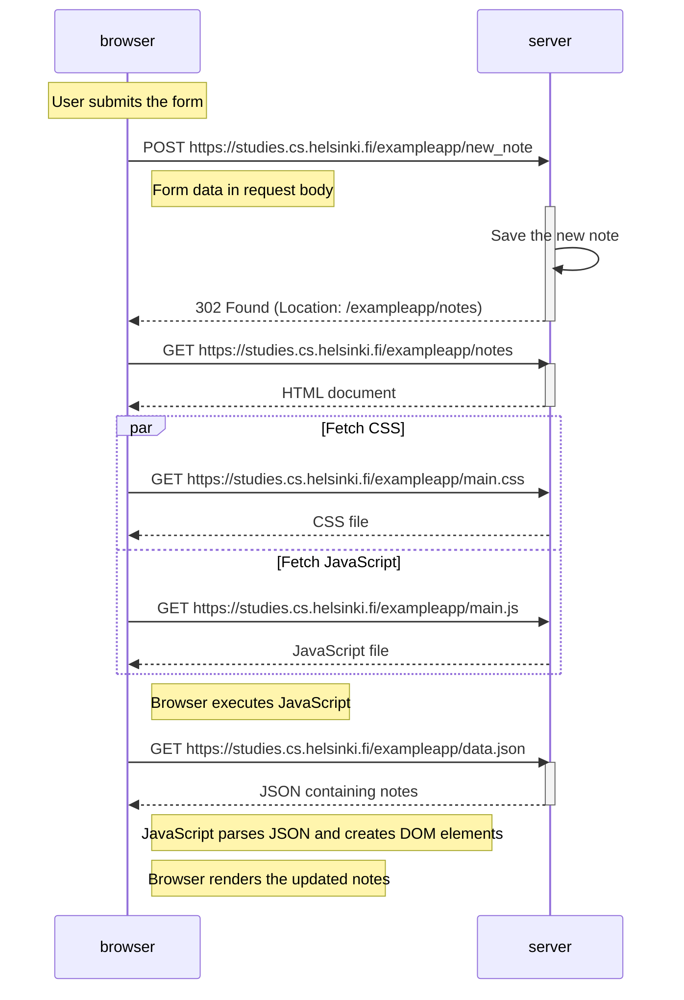

```mermaid
sequenceDiagram
participant browser
participant server

    Note over browser: User submits the form

    browser->>server: POST https://studies.cs.helsinki.fi/exampleapp/new_note
    Note right of browser: Form data in request body
    activate server
    server->>server: Save the new note
    server-->>browser: 302 Found (Location: /exampleapp/notes)
    deactivate server

    browser->>server: GET https://studies.cs.helsinki.fi/exampleapp/notes
    activate server
    server-->>browser: HTML document
    deactivate server

    par Fetch CSS
        browser->>server: GET https://studies.cs.helsinki.fi/exampleapp/main.css
        server-->>browser: CSS file
    and Fetch JavaScript
        browser->>server: GET https://studies.cs.helsinki.fi/exampleapp/main.js
        server-->>browser: JavaScript file
    end

    Note right of browser: Browser executes JavaScript

    browser->>server: GET https://studies.cs.helsinki.fi/exampleapp/data.json
    activate server
    server-->>browser: JSON containing notes
    deactivate server

    Note right of browser: JavaScript parses JSON and creates DOM elements
    Note right of browser: Browser renders the updated notes
```
