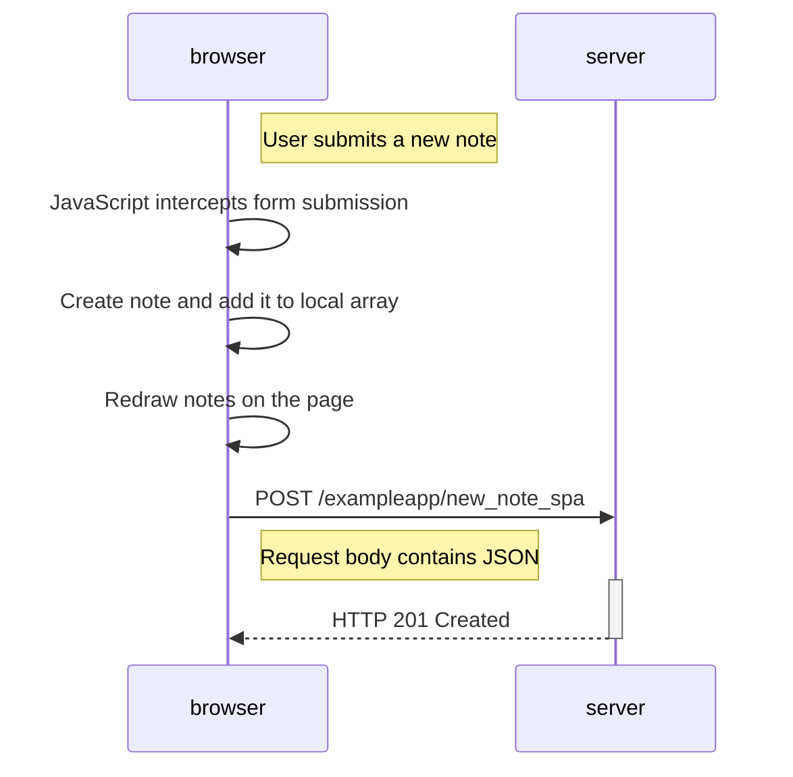

```mermaid
sequenceDiagram
participant browser
participant server

    Note right of browser: User submits a new note

    browser->>browser: JavaScript intercepts form submission
    browser->>browser: Create note and add it to local array
    browser->>browser: Redraw notes on the page

    browser->>server: POST /exampleapp/new_note_spa
    Note right of browser: Request body contains JSON

    activate server
    server-->>browser: HTTP 201 Created
    deactivate server
```
